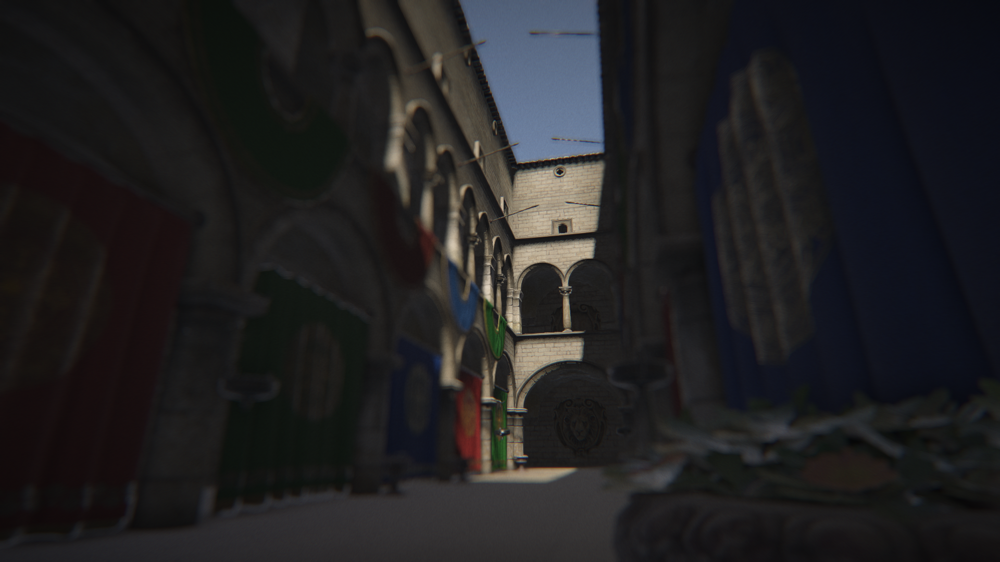
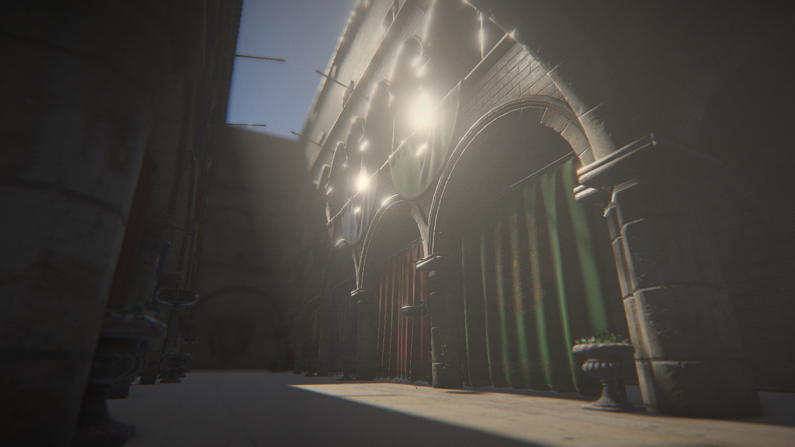
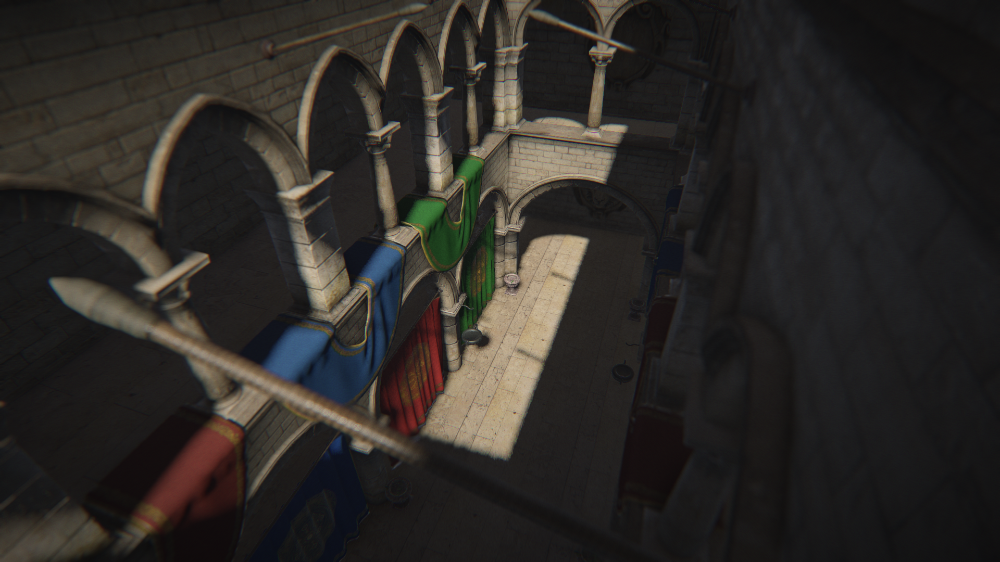
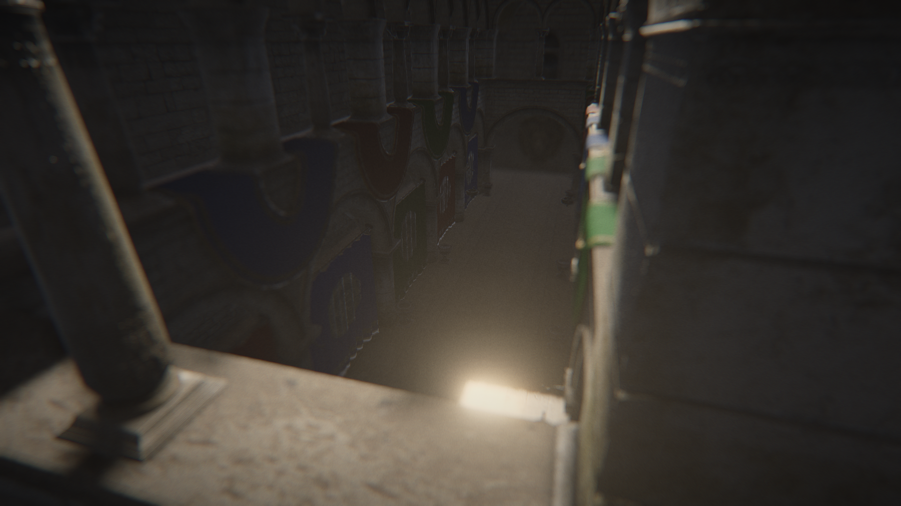

# Sponza BBMOD
> Crytek Sponza rendered in GameMaker using BBMOD

## Controls
* WASDEQ - move
* LMB - enable mouselook
* RMB - change autofocus point (when mouselook is disabled)
* Esc - disable mouselook
* F - change sun direction to camera's forward vector
* Space - recapture reflection probe

## License
Uses BBMOD 3.21.2, available from https://github.com/blueburncz/BBMOD under MIT license.

Asset credits available at [datafiles/Data/AssetCredits.txt](datafiles/Data/AssetCredits.txt).
